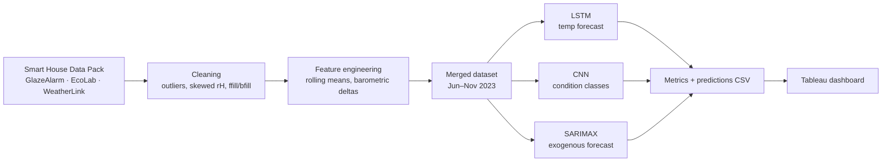

<div align="center">

# 🏠 Smart Home Energy Predictions: IoT + Machine Learning

**Forecasting indoor temperature and classifying comfort conditions from multi-sensor smart-home IoT data with LSTM, CNN, and SARIMAX.**


<a href="https://colab.research.google.com/github/oxayavongsa/iot-smarthouse-energy/blob/main/Final_Code_G3.ipynb"></a>

</div>

## Overview
Heating and cooling drive a large share of residential energy use. If a home can **anticipate indoor temperature** and **recognize uncomfortable conditions** (humid, dry, unstable) before they happen, HVAC can be scheduled proactively instead of reactively. This project builds that forecasting and classification layer from real IoT sensor streams: EcoLab Ground and WeatherLink Indoor sensors merged into a unified dataset of 100,000+ records (Jun–Nov 2023 modeling window).

## 📊 Key Results
Figures are from the notebook outputs (`Final_Code_G3.ipynb`), the saved metric files in `Data/`, and `Final_Paper_G3.pdf`.

| Model | Task | Result |
|---|---|---|
| **LSTM** (optimized) | Next-step indoor temp forecast | **RMSE 0.81 °C**, MAE 0.63 °C, MAPE 3.68%, R² 0.68 |
| **CNN** | 4-class condition classification | **94.5% accuracy**, weighted F1 0.96, precision 0.98 |
| **SARIMAX** | Exogenous temp forecast (1/6/24 h rolling) | RMSE 1.04 °C, MAE 0.82 °C, R² 0.47 |

- LSTM was the strongest forecaster; SARIMAX was competitive at 1-hour horizons but smoothed out detail at 6–24 h.
- The CNN scored well on common classes (F1 0.96–0.98) but the rare **"unstable"** class (112 of 13,142 test samples) reached only 0.16 precision, so class imbalance is the main open issue.

<p align="center">
  
  
</p>
<p align="center">
  
</p>

📈 **Interactive dashboard:** [Smart Home IoT Dashboard on Tableau Public](https://public.tableau.com/views/FinalPredictions/IoTSmartHomeDashboard?:language=en-US&:sid=&:redirect=auth&:display_count=n&:origin=viz_share_link) (PDF snapshot: `Final_Dashboard_G3.pdf`)

## 🔧 Approach


## 🗂️ Dataset
**Smart House Data Pack (2022–2023)**, Suffolk Sustainability Institute, [Kaggle](https://www.kaggle.com/datasets/ssiatuos/smart-house-data-pack), licensed CC BY-NC 4.0. Cleaned extracts used for modeling are in `Data/` (`EcoLab Ground Cleaned.csv`, `Weather Link Indoor Cleaned.csv`, `Front Door Cleaned.csv`).

## 🧰 Tech Stack
Python · pandas · NumPy · TensorFlow/Keras · scikit-learn · statsmodels · Matplotlib · Seaborn · Tableau · Google Colab (A100)

## 📁 Repository Structure
```
iot-smarthouse-energy/
├── Data/                    # cleaned sensor CSVs, model metrics & predictions, .keras models
├── Visuals/                 # EDA, model, and forecast charts
├── Final_Code_G3.ipynb      # end-to-end notebook (EDA → LSTM / CNN / SARIMAX)
├── Final_Code_G3.pdf        # notebook export
├── Final_Paper_G3.pdf       # technical paper
├── Final_Dashboard_G3.pdf   # Tableau dashboard export
├── requirement.txt
└── LICENSE
```

## ▶️ How to Run
```bash
git clone https://github.com/oxayavongsa/iot-smarthouse-energy.git
cd iot-smarthouse-energy
pip install numpy pandas matplotlib seaborn scikit-learn "tensorflow==2.15.0" statsmodels jupyter
jupyter notebook Final_Code_G3.ipynb
```
The full dependency list is in `requirement.txt`. To re-run from raw data, download the Kaggle data pack into `./smart-house-data-pack/` (the notebook's expected path). Or just open it in Colab with the badge above. Pre-trained models (`final_cnn_model.keras`, `lstm_model_optimized.keras`) can be loaded with `tf.keras.models.load_model`.

## 👥 Team
- **Outhai Xayavongsa (Thai)**, Team Leader
- **Aaron Ramirez**, Tech Lead

Course: AAI-530 Data Analytics and the Internet of Things, Prof. Anna Marbut, University of San Diego (M.S. Applied Artificial Intelligence)

## 📄 License
Code: Apache License 2.0. Dataset: CC BY-NC 4.0 (non-commercial). See [LICENSE](LICENSE).

---
<div align="center">
Built by <a href="https://github.com/oxayavongsa">Outhai (Thai) Xayavongsa</a> · <a href="https://oxayavongsa.github.io/ai-automation-portfolio/">Portfolio</a>
</div>
